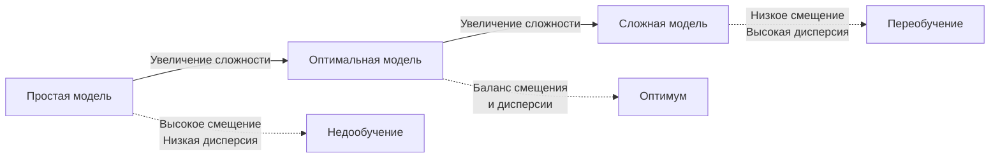
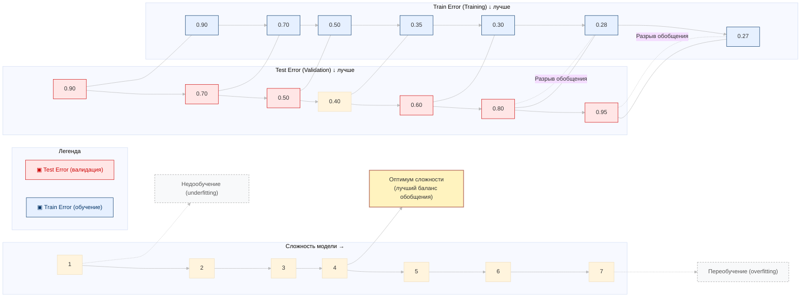

# Полиномиальная регрессия и продвинутые техники

## Полиномиальная регрессия: Когда прямой недостаточно

### Зачем нужна полиномиальная регрессия?

Линейная регрессия отлично работает, когда связь между признаками и целевой переменной действительно линейная (прямая линия). Но в реальности большинство зависимостей имеют более сложный характер — это могут быть параболы, экспоненты, логарифмы.

**Полиномиальная регрессия используется, когда:**
- Между признаками и целевой переменной наблюдается нелинейная связь
- Визуализация данных показывает изогнутую зависимость
- Существует взаимодействие между признаками (синергетический эффект)

**Формула полиномиальной регрессии:**
$\hat{y}$ = $\beta_0$ + $\beta_1 x$ + $\beta_2 x^2$ + $\beta_3 x^3$ + \cdots + $\beta_n x^n$

где $n$ — степень полинома.

**Пример:** Зависимость между температурой и продажами мороженого часто нелинейна: до 25°C продажи растут быстро, потом рост замедляется, а при экстремальной жаре может даже снизиться.

**О степени полинома:** Степень полинома определяет сложность модели. Полином 1-й степени — это обычная линейная регрессия. Полином 2-й степени дает параболу, 3-й степени — кубическую функцию с изгибами. Чем выше степень, тем более извилистой становится линия регрессии и тем лучше она может описать сложные закономерности. Однако высокая степень полинома (например, 10 или 15) может привести к переобучению — модель будет идеально описывать обучающие данные, включая шум, но плохо работать на новых данных. Практически редко используют степень выше 3-4 без специальной регуляризации.

> [!TIP]
> **Условие числа и численная стабильность**
> 
> При высоких степенях полинома возникает проблема **плохой обусловленности матрицы** (high condition number). Матрица признаков $X^TX$ становится почти вырожденной, что приводит к численной нестабильности при вычислении коэффициентов. Столбцы матрицы (например, $x, x^2, x^3$) становятся линейно зависимыми, особенно когда значения $x$ лежат в узком диапазоне.
> 
> **Решение:** центрирование и масштабирование признаков **перед** созданием полиномиальных признаков. Используйте ортогональные полиномы (Чебышёва, Лежандра) вместо стандартных степенных — они ортогональны и численно стабильны.

> [!WARNING]
> **Феномен Рунге (Runge's phenomenon)**
> 
> При использовании полиномов высокой степени на равномерно распределённых точках возникают **осцилляции на краях** интервала, даже если функция гладкая. Это делает экстраполяцию за пределы обучающих данных крайне ненадёжной.
> 
> **Практический совет:** ограничивайте предсказания областью, покрытой обучающими данными. Для экстраполяции используйте физически обоснованные модели или сплайны вместо полиномов.

> [!TIP]
> **Связь с числом параметров**
> 
> Для полинома степени $d$ с $p$ признаками количество параметров растёт как $\binom{p+d}{d}$ (биномиальный коэффициент). При $p=10$ и $d=3$ получаем 286 параметров — легко переобучиться при малом объёме данных.

---

## Баланс смещения и разброса (Bias-Variance Trade-off)

### Две стороны ошибки модели

Общая ошибка любой модели машинного обучения складывается из трёх компонентов: смещения, дисперсии и неустранимого шума.

**Смещение (Bias)** — это систематическая ошибка модели. Показывает, насколько в среднем предсказания модели отклоняются от истинных значений.
- Высокое смещение = модель слишком простая
- Модель делает неправильные предположения о структуре данных
- Пример: пытаемся описать параболу прямой линией

**Дисперсия (Variance)** — это чувствительность модели к конкретному набору обучающих данных. Показывает, насколько сильно будут различаться предсказания, если обучить модель на разных подвыборках данных.
- Высокая дисперсия = модель слишком сложная
- Модель "запоминает" обучающие данные вместо того, чтобы учиться общим закономерностям
- Пример: полином 15-й степени, проходящий через каждую точку

**Суть компромисса:** Невозможно одновременно минимизировать и смещение, и дисперсию. Уменьшая одно, мы увеличиваем другое.

**Математическая декомпозиция ошибки:**

$\text{Total Error}$ = $\text{Bias}^2$ + $\text{Variance}$ + $\text{Irreducible Error}$

**О неустранимом шуме:** Irreducible Error (неустранимая ошибка) — это шум, присущий самим данным, который невозможно устранить никакой моделью. Это может быть ошибка измерений, случайные флуктуации, влияние неучтённых факторов. Например, если мы предсказываем цену квартиры, то некоторые аспекты (настроение продавца, удачный день просмотра) невозможно формализовать и включить в модель. Эта компонента ошибки напоминает, что идеальная модель с нулевой ошибкой в принципе недостижима.

### Визуализация компромисса

> [!NOTE]
> **Формальная декомпозиция ошибки**
> 
> Для фиксированной точки $x$ математическое ожидание квадратичной ошибки раскладывается как:
> 
> $$
> \mathbb{E}_{y,S}[(y - f_S(x))^2] = \sigma^2 + \text{Var}_S[f_S(x)] + \text{Bias}^2[f_S(x)]
> $$
> 
> где $\sigma^2$ - неустранимый шум данных, $\text{Var}_S[f_S(x)]$ - дисперсия предсказаний при обучении на разных выборках, $\text{Bias}[f_S(x)]$ - разность среднего предсказания и истинной функции.

## Переобучение и недообучение: Две крайности

### Недообучение (Underfitting)

**Признаки:**
- Модель не улавливает закономерности даже в обучающих данных
- Высокое смещение, низкая дисперсия
- Плохое качество и на train, и на test выборках
- Ошибка на обучающей выборке высокая

**Примеры:**
- Линейная регрессия для явно нелинейных данных
- Полином 1-й степени для сложной зависимости
- Модель с недостаточным числом признаков

**Как исправить:**
- Увеличить сложность модели (добавить полиномиальные признаки)
- Добавить новые информативные признаки
- Уменьшить силу регуляризации

### Переобучение (Overfitting)

**Признаки:**
- Модель "запоминает" обучающие данные вместе с шумом
- Низкое смещение, высокая дисперсия
- Отличное качество на train, плохое — на test
- Большой разрыв между train и test ошибками

**Примеры:**
- Полином очень высокой степени (10+)
- Слишком много признаков относительно количества наблюдений
- Отсутствие регуляризации при большом числе параметров

**Как исправить:**
- Применить регуляризацию (Ridge, LASSO, Elastic Net)
- Уменьшить сложность модели
- Увеличить объем обучающих данных
- Использовать кросс-валидацию
- Применить отбор признаков (feature selection)

**О кросс-валидации:** Cross-validation — техника, которая помогает надёжно оценить качество модели и защититься от переобучения. Данные разбиваются на k частей (обычно 5 или 10). Модель обучается k раз, каждый раз используя k-1 часть для обучения и 1 часть для валидации. Затем результаты усредняются. Это даёт более честную оценку качества модели, чем однократное разделение на train/test, и помогает подобрать оптимальные гиперпараметры. K-fold cross-validation особенно полезна при ограниченном объёме данных.

> [!NOTE]
> **Коэффициент обобщения (Generalization Gap)**
> 
> $$
> \text{Gap} = \frac{\text{Train Error} - \text{Test Error}}{\text{Train Error}}
> $$
> 
> **Интерпретация:**
> - Gap < 0.1 (10%) - хорошая модель
> - Gap 0.1-0.3 - лёгкое переобучение, допустимо
> - Gap > 0.3 - сильное переобучение, требуется регуляризация

### Определение оптимальной сложности

**Практический подход:**
1. Начните с простой модели (полином 1-й степени)
2. Постепенно увеличивайте сложность (2, 3, 4 степень)
3. Отслеживайте ошибку на train и test выборках
4. Выберите степень, при которой test ошибка минимальна
5. Если test ошибка начала расти — вы переобучились

---

## Регуляризация: Контроль сложности модели

### Зачем нужна регуляризация?

Регуляризация — это способ борьбы с переобучением путём добавления штрафа за сложность модели. Вместо минимизации только ошибки, модель минимизирует ошибку плюс штраф за большие коэффициенты.

**Преимущества:**
- Уменьшает дисперсию (variance) модели
- Предотвращает переобучение
- Позволяет работать с большим количеством признаков
- Помогает бороться с мультиколлинеарностью (когда признаки сильно коррелированы)

**Основная идея:** Добавить в функцию потерь штрафной член, который "наказывает" модель за использование больших коэффициентов или слишком большого числа признаков.

> [!TIP]
> **Effective Degrees of Freedom (EDF)**
> 
> Для регуляризованных моделей эффективное число параметров:
> 
> $$
> \text{EDF} = \text{tr}(X(X^TX + \lambda I)^{-1}X^T)
> $$
> 
> При $\lambda \to 0$, EDF $\to p$ (все параметры свободны). При $\lambda \to \infty$, EDF $\to 0$ (модель полностью подавлена).

---

## Типы регуляризации: Ridge, LASSO, Elastic Net

### Ridge регрессия (L2-регуляризация)

**Формула:**

> $$
> \text{Loss} = \sum_{i=1}^n (y_i - \hat{y}_i)^2 + \lambda \sum_{j=1}^p \beta_j^2
> $$

где $\lambda$ — параметр регуляризации (сила штрафа).

**Особенности:**
- Использует квадрат коэффициентов в штрафе
- Уменьшает все коэффициенты, но не обнуляет их полностью
- Хорошо работает при мультиколлинеарности
- Все признаки остаются в модели, но с меньшими весами

**Когда использовать:**
- Когда все признаки потенциально важны
- При наличии коррелированных признаков
- Когда нужна стабильность модели

**О мультиколлинеарности:** Мультиколлинеарность возникает, когда несколько признаков сильно коррелированы друг с другом. Например, площадь квартиры и количество комнат обычно связаны. Это создаёт проблему: модель не может точно определить вклад каждого признака отдельно, коэффициенты становятся нестабильными и могут принимать очень большие значения. Ridge регрессия решает эту проблему, распределяя веса между коррелированными признаками и уменьшая их амплитуду. Это делает модель более стабильной и надёжной.

### LASSO регрессия (L1-регуляризация)

**Формула:**

> $$
> \text{Loss} = \sum_{i=1}^n (y_i - \hat{y}_i)^2 + \lambda \sum_{j=1}^p |\beta_j|
> $$

**Особенности:**
- Использует абсолютное значение коэффициентов в штрафе
- Может полностью обнулять коэффициенты незначимых признаков
- Выполняет автоматический отбор признаков (feature selection)
- Создаёт разреженную (sparse) модель

**Когда использовать:**
- Когда важен отбор признаков
- При большом количестве признаков, многие из которых неинформативны
- Когда нужна интерпретируемая модель с малым числом признаков

**Почему LASSO обнуляет коэффициенты:** Математическая причина в том, что L1-норма (сумма модулей) имеет "острые углы" в пространстве параметров. При оптимизации решение часто попадает в эти углы, где некоторые коэффициенты равны нулю. L2-норма (сумма квадратов) образует гладкую сферу, поэтому Ridge "сжимает" коэффициенты к нулю, но редко делает их точно нулевыми. Это свойство LASSO делает его мощным инструментом для feature selection — автоматически отбрасываются неинформативные признаки.

> [!NOTE]
> **Геометрическая интерпретация L1 vs L2**
> 
> **Ridge (L2):** контур штрафа - сфера $\|\boldsymbol{\beta}\|_2^2 = \text{const}$. При оптимизации решение редко попадает точно на ось (где коэффициент = 0).
> 
> **LASSO (L1):** контур штрафа - ромб $\|\boldsymbol{\beta}\|_1 = \text{const}$ с **острыми углами на осях**. Градиентный спуск часто приводит решение именно в эти углы, где часть коэффициентов строго равна нулю. Это объясняет автоматический feature selection в LASSO.

### Elastic Net (Комбинация L1 и L2)

**Формула:**

>$$
>\text{Loss} = \sum_{i=1}^n (y_i - \hat{y}_i)^2 + \lambda_1 \sum_{j=1}^p |\beta_j| + \lambda_2 \sum_{j=1}^p \beta_j^2
>$$

Или в альтернативной записи:

>$$
>\text{Loss} = \text{MSE} + \lambda \left( \alpha \sum_{j=1}^p |\beta_j| + (1-\alpha) \sum_{j=1}^p \beta_j^2 \right)
>$$

где $\alpha$ контролирует баланс между L1 и L2 (при $\alpha$ получаем LASSO, при $\alpha$ — Ridge).

> [!TIP]
> **Adaptive LASSO и группировка коэффициентов**
> 
> Стандартный LASSO при наличии **группы сильно коррелированных признаков** произвольно выбирает один из них, игнорируя остальные. Elastic Net решает эту проблему: параметр $(1-\alpha)$ группирует коррелированные признаки, давая им схожие ненулевые веса. При высокой корреляции между признаками $j$ и $k$ Elastic Net стремится сделать $|\beta_j - \beta_k|$ малым.

> [!NOTE]
> **Вычислительная сложность регуляризации**
> 
> - **Ridge:** аналитическое решение $\boldsymbol{\beta} = (X^TX + \lambda I)^{-1}X^Ty$, сложность $O(p^3)$
> - **LASSO:** нет аналитического решения, требует итеративной оптимизации (coordinate descent, LARS), сложность $O(p^2n)$
> - **Elastic Net:** итеративная оптимизация, но более стабильная сходимость, чем у LASSO

где $\alpha$ контролирует баланс между L1 и L2 (при $\alpha$ получаем LASSO, при $\alpha$ — Ridge).

**Особенности:**
- Сочетает преимущества Ridge и LASSO
- Может обнулять признаки (как LASSO) и обрабатывать мультиколлинеарность (как Ridge)
- Более стабильна, чем LASSO, при наличии групп коррелированных признаков
- Имеет два гиперпараметра для настройки

**Когда использовать:**
- При наличии групп коррелированных признаков
- Когда нужен баланс между feature selection и стабильностью
- В большинстве практических задач (часто показывает лучшие результаты)

---

## Сравнительная таблица методов регуляризации

| Критерий                       | Ridge (L2)          | LASSO (L1)             | Elastic Net            |
| ------------------------------ | ------------------- | ---------------------- | ---------------------- |
| **Обнуление коэффициентов**    | Нет                 | Да                     | Да                     |
| **Feature selection**          | Не выполняет        | Выполняет              | Выполняет              |
| **Мультиколлинеарность**       | Хорошо обрабатывает | Может быть нестабильна | Хорошо обрабатывает    |
| **Количество гиперпараметров** | 1 $\lambda$         | 1 $\lambda$            | 2 $\lambda$ , $\alpha$ |
| **Интерпретируемость**         | Средняя             | Высокая                | Высокая                |
| **Стабильность**               | Высокая             | Средняя                | Высокая                |
| **Лучше всего для**            | Все признаки важны  | Отбор признаков        | Универсальное решение  |

---

## Масштабирование признаков: Обязательный шаг

### Почему масштабирование критично?

Многие алгоритмы машинного обучения чувствительны к масштабу признаков. Если один признак измеряется в рублях (0-1000000), а другой в квадратных метрах (0-100), то алгоритм может уделить непропорционально большое внимание первому признаку просто из-за большего числового диапазона.

**Проблемы без масштабирования:**
- Медленная сходимость градиентного спуска
- Неправильные веса признаков в регуляризованных моделях
- Искажённые расчёты расстояний в kNN, SVM
- Неверная интерпретация важности признаков

**Алгоритмы, требующие масштабирования:**
- Линейная и логистическая регрессия с регуляризацией
- SVM (метод опорных векторов)
- k-ближайших соседей (kNN)
- Нейронные сети
- PCA и другие методы снижения размерности
- Градиентный бустинг на расстояниях

**Алгоритмы, НЕ требующие масштабирования:**
- Деревья решений
- Случайный лес (Random Forest)
- Градиентный бустинг на деревьях (XGBoost, LightGBM)

**Почему регуляризация требует масштабирования:** Регуляризация добавляет штраф на размер коэффициентов. Если признаки имеют разный масштаб, то коэффициенты при них тоже будут разного масштаба. Признак с маленькими значениями (например, 0-1) получит большой коэффициент, а признак с большими значениями (0-10000) — маленький коэффициент. В результате штраф регуляризации будет несправедливо наказывать признаки с маленькими значениями. После масштабирования все признаки приводятся к единому масштабу, и регуляризация работает корректно.

> [!WARNING]
> **Проблема категориальных признаков**
> 
> One-hot encoded признаки имеют разный масштаб (0/1), чем непрерывные. **Не масштабируйте категориальные признаки** — это разрушает их интерпретируемость и может исказить регуляризацию.

---

## Методы масштабирования

### Стандартизация (Standardization, Z-score normalization)

**Формула:**

$X_{\text{scaled}}$ = $\frac{X - \mu}{\sigma}$

где $\mu$ — среднее, $\sigma$ — стандартное отклонение.

**Результат:** данные имеют среднее = 0 и стандартное отклонение = 1.

**Преимущества:**
- Устойчива к выбросам (в разумных пределах)
- Сохраняет информацию о выбросах
- Подходит для большинства алгоритмов ML
- Данные не ограничены определённым диапазоном

**Когда использовать:**
- По умолчанию для большинства задач
- Для линейных моделей с регуляризацией
- Для SVM, логистической регрессии
- Для PCA и других методов на основе дисперсии

### Нормализация (Min-Max Scaling)

**Формула:**

$X_{\text{scaled}}$ = $\frac{X - X_{\min}}{X_{\max} - X_{\min}}$

**Результат:** данные находятся в диапазоне [0, 1].

**Преимущества:**
- Данные в фиксированном диапазоне
- Удобна для нейронных сетей
- Хорошо для данных с естественными границами

**Недостатки:**
- Очень чувствительна к выбросам
- Один экстремальный выброс может "сжать" все остальные значения

**Когда использовать:**
- Для нейронных сетей (особенно изображения)
- Когда данные уже имеют ограниченный диапазон
	- Для алгоритмов, требующих данные в [0, 1]

> [!TIP]
> **Robust Scaling для выбросов**
> 
> При наличии выбросов StandardScaler искажается. Используйте **RobustScaler**, основанный на медиане и квартилях:
> 
> $$
> X_{\text{scaled}} = \frac{X - \text{median}(X)}{\text{IQR}(X)}
> $$
> 
> где IQR = Q3 - Q1 (межквартильный размах). Устойчив к выбросам, в отличие от среднего и стандартного отклонения.

---

## Правильный процесс масштабирования

### Критически важно: Train/Test Split ПЕРЕД масштабированием

**Неправильно:**
# ОШИБКА: масштабирование до разделения

X_scaled = scaler.fit_transform(X)  
X_train, X_test = train_test_split(X_scaled)

#  ПРАВИЛЬНО: сначала разделение, потом масштабирование

X_train, X_test = train_test_split(X)  
scaler = StandardScaler()  
X_train_scaled = scaler.fit_transform(X_train) # fit на train  
X_test_scaled = scaler.transform(X_test) # только transform на test

**Почему это важно:** Если сначала масштабировать, а потом делить данные, то информация из тестовой выборки (среднее, минимум, максимум) "просочится" в обучающую выборку через параметры масштабирования. Это называется data leakage (утечка данных) и приводит к завышенной оценке качества модели. В реальности на новых данных модель будет работать хуже. Правильный подход: вычислить параметры масштабирования (среднее, стандартное отклонение) только на обучающей выборке, а затем применить эти же параметры к тестовой выборке.

### Пример полного pipeline

from sklearn.preprocessing import PolynomialFeatures, StandardScaler  
from sklearn.linear_model import Ridge  
from sklearn.model_selection import train_test_split

# 1. Разделение данных

X_train, X_test, y_train, y_test = train_test_split(X, y, test_size=0.2, random_state=42)

# 2. Создание полиномиальных признаков

poly = PolynomialFeatures(degree=3, include_bias=False)  
X_train_poly = poly.fit_transform(X_train)  
X_test_poly = poly.transform(X_test)

# 3. Масштабирование

scaler = StandardScaler()  
X_train_scaled = scaler.fit_transform(X_train_poly)  
X_test_scaled = scaler.transform(X_test_poly)

# 4. Обучение модели с регуляризацией

model = Ridge(alpha=1.0)  
model.fit(X_train_scaled, y_train)

# 5. Оценка

train_score = model.score(X_train_scaled, y_train)  
test_score = model.score(X_test_scaled, y_test)

print(f"Train R²: {train_score:.3f}")  
print(f"Test R²: {test_score:.3f}")

---

## Практические рекомендации

### Выбор степени полинома
1. Начните с визуализации данных — определите примерный характер зависимости
2. Попробуйте степени 1, 2, 3, 4
3. Сравните ошибки на train и test
4. Если test ошибка растёт — снизьте степень или добавьте регуляризацию
5. Степени выше 4-5 используйте только с сильной регуляризацией

### Выбор типа регуляризации
1. **Начните с Elastic Net** — обычно даёт хорошие результаты
2. Если важен feature selection — используйте LASSO
3. Если все признаки важны — используйте Ridge
4. При наличии мультиколлинеарности — Ridge или Elastic Net

### Подбор гиперпараметров
1. Используйте GridSearchCV или RandomizedSearchCV для подбора $\lambda$ и $\alpha$
2. Применяйте кросс-валидацию (обычно 5-10 фолдов)
3. Для $\lambda$ пробуйте значения в логарифмической шкале: 0.001, 0.01, 0.1, 1, 10, 100
4. Для $\alpha$ в Elastic Net пробуйте: 0.1, 0.3, 0.5, 0.7, 0.9

> [!TIP]
> **Выбор λ через информационные критерии**
> 
> Кроме кросс-валидации, можно использовать **AIC** (Akaike Information Criterion) или **BIC** (Bayesian Information Criterion):
> 
> $$
> \text{AIC} = n \ln(\text{MSE}) + 2k
> $$
> 
> $$
> \text{BIC} = n \ln(\text{MSE}) + k \ln(n)
> $$
> 
> где $k$ - эффективное число параметров. BIC сильнее штрафует сложность и выбирает более простые модели.

### Контроль переобучения
1. Всегда сравнивайте метрики на train и test
2. Разрыв более 10-15% — признак переобучения
3. Используйте learning curves для визуализации
4. Увеличивайте данные, если это возможно
5. Применяйте регуляризацию постепенно, начиная с малых $\lambda$

> [!TIP]
> **Выбор λ через информационные критерии**
> 
> Кроме кросс-валидации, можно использовать **AIC** (Akaike Information Criterion) или **BIC** (Bayesian Information Criterion):
> 
> $$
> \text{AIC} = n \ln(\text{MSE}) + 2k
> $$
> 
> $$
> \text{BIC} = n \ln(\text{MSE}) + k \ln(n)
> $$
> 
> где $k$ - эффективное число параметров. BIC сильнее штрафует сложность и выбирает более простые модели.

### Выбор метода валидации

> [!TIP]
> **TimeSeriesSplit для временных рядов**
> 
> Обычная K-Fold нарушает временной порядок. Используйте **TimeSeriesSplit**: обучающая выборка всегда предшествует валидационной. Это критично для временных данных, где будущее не должно влиять на прошлое.

> [!NOTE]
> **Leave-One-Out CV (LOOCV)**
> 
> При очень малых данных ($n < 100$) используйте LOOCV: $k = n$, каждый раз обучаем на $n-1$ примерах. Даёт почти несмещённую оценку, но вычислительно дорого и имеет высокую дисперсию.

> [!WARNING]
> **Nested Cross-Validation**
> 
> Для **честной оценки** с подбором гиперпараметров используйте вложенную CV:
> - Внешний цикл: оценка качества финальной модели
> - Внутренний цикл: подбор $\lambda$ и $\alpha$
> 
> Без этого оценка качества завышена из-за data leakage через подбор гиперпараметров.

> [!TIP]
> **Learning Curves (кривые обучения)**
> 
> Learning curves — это графики, показывающие зависимость ошибки модели от размера обучающей выборки или от количества итераций обучения. На графике обычно две линии: ошибка на обучающей выборке и на валидационной.
> 
> **Диагностика по кривым обучения:**
> - **Недообучение:** обе ошибки высоки и близки друг к другу — модель слишком простая
> - **Переобучение:** ошибка на обучающей выборке низкая, а на валидационной высокая с большим разрывом — модель запомнила данные
> - **Хорошая модель:** обе ошибки низкие и сходятся к одному значению
> 
> Learning curves помогают диагностировать проблемы и понять, поможет ли добавление данных улучшить модель. Если кривые сходятся на высоком уровне ошибки — нужна более сложная модель. Если есть большой разрыв — помогут регуляризация или больше данных.
